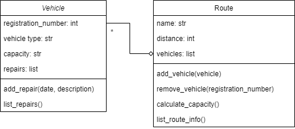

# Data Processing and Representations Exam

This is a digital exam. The exam consists of programming exercises that are purely based on input, output, and calculations. You will use these exercises to show that you can write a data processing program from scratch using tools covered in this course.

During the exam, **you are allowed use the internet and the code you have written for the PDP and DPR modules**. You are obviously not allowed to message other students, so make sure any and all messaging applications are closed for the entire duration of the exam. You are also not allowed to use ChatGPT or similar tools that can write code for you. The only allowed tools are an editor with your code, possibly with code from earlier assignments, your terminal and a browser for searching for other coding resources and documentation.

_You will not be graded on design, but only on the correctness of your code_ and whether you met the requirements. You do not have to comment your code, nor do you have to abide by any other styling rules (though this can greatly help you understand your code).

This exam consists of 3 parts. Each of the parts can be made separately and are fully independent of each other.

## Rules

- Finish all exercises in a file named `exam.py` and submit this file
- Define any functions and/or classes you write at the top of the file, and add the provided tests at the bottom of the file in order of the exercises.
- Make sure the provided tests are *all* printed (or shown) when running your program. Separate the prints for each exercise with an extra print like `print("\n=== Exercise 1 ===")`, so it is clear which output belongs to which exercise.
- Not all exercises need to be perfect to pass the exam. If you do not know how to proceed, describe what you want your code to do.
- You are allowed use the internet and the code you have written for the PDP and DPR modules
- You are *not* allowed to contact other students
- You are *not* allowed to use ChatGPT or similar tools that can write code for you.

*Before you leave the exam room, check with us that your submission was correctly submitted!*

# The Exam

[widgets.csv](../data/widgets.csv)
