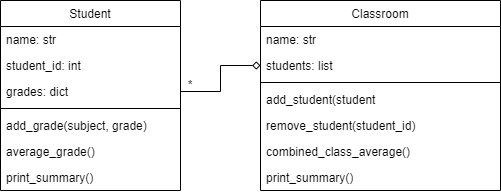

# Data Processing and Representations Exam

This is a digital exam. The exam consists of programming exercises that are purely based on input, output, and calculations. You will use these exercises to show that you can write a data processing program from scratch using tools covered in this course.

During the exam, **you are allowed use the internet and the code you have written for the PDP and DPR modules**. You are obviously not allowed to message other students, so make sure any and all messaging applications are closed for the entire duration of the exam. You are also not allowed to use ChatGPT or similar tools that can write code for you. The only allowed tools are an editor with your code, possibly with code from earlier assignments, your terminal and a browser for searching for other coding resources and documentation.

_You will not be graded on design, but only on the correctness of your code_ and whether you met the requirements. You do not have to comment your code, nor do you have to abide by any other styling rules (though this can greatly help you understand your code).

This exam consists of 3 parts. Each of the parts can be made separately and are fully independent of each other.

## Rules

- Finish all exercises in a file named `exam.py` and submit this file
- Define any functions and/or classes you write at the top of the file, and add the provided tests at the bottom of the file in order of the exercises.
- Make sure the provided tests are *all* printed (or shown) when running your program. Separate the prints for each exercise with an extra print like `print("\n=== Exercise 1 ===")`, so it is clear which output belongs to which exercise.
- Not all exercises need to be perfect to pass the exam. If you do not know how to proceed, describe what you want your code to do.
- You are allowed use the internet and the code you have written for the PDP and DPR modules
- You are *not* allowed to contact other students
- You are *not* allowed to use ChatGPT or similar tools that can write code for you.

*Before you leave the exam room, check with us that your submission was correctly submitted!*

# The Exam

## Part 1: OOP

You are tasked with creating a simple school management system for a highschool. To do this, you will implement two classes: `Student` and `Classroom`. `Student` contains all information about a student, such as their name, student ID, and their grades. The `Classroom` class contains information about a group of students, such as the name of the classroom and the students that are in that classroom.

The following UML describes these classes and their relation:

Implement `Student` with the following methods:

- `__init__(name, student_id)`: create a new instance with the student's name and ID as provided by the parameters and initialize the attribute `grades` as an empty dictionary.
- `add_grade(subject, grade)`: sets the `grade` for a particular `subject` in the `grades` dictionary. Subjects should be the keys, and the grades should be the values.
- `average_grade()`: returns the average grade over all `grades` for this student.
- `print_summary()`: prints the student's name, ID, and average grade. _See the example below for the format!_

Implement `Classroom` wit the following methods:

- `__init__(name)`: create a new instance with the information provided by the parameters and initialize the attribute `students` as an empty dictionary.
- `add_student(student)`: add a given `Student` to the `students` dictionary. The key in this dictionary should be the student's ID, and the value should be the given `Student` instance.
- `remove_student(student_id)`: removes a student from the classroom by their student ID.
- `combined_class_average()`: returns the average of all students' average grades. **Hint:** use the `average_grade()` method!
- `print_summary()`: prints the name of the class and the average of all students' average grade. Then prints the summary of all students using the `Student`'s `print_summary()`. _See the example below for the format!_

Test your code by running the code below:

    print('\n=== Part 1: OOP ===')

    # Creating a student and adding grades to the dictionary
    s_alice = Student("Alice", "S123456")
    s_alice.add_grade("Math", 8.0)
    s_alice.add_grade("English", 9.4)
    s_alice.add_grade("History", 6.0)

    print("Printing Alice's summary, who's average should be a 7.8:")
    s_alice.print_summary()

    s_bob = Student("Bob", "S213892")
    s_bob.add_grade("Math", 7.8)
    s_bob.add_grade("English", 7.4)

    print("\nPrinting Bob's summary, who's average should be a 7.6:")
    s_bob.print_summary()

    # Adding students to the classroom
    classroom = Classroom("Juniors")
    classroom.add_student(s_alice)
    classroom.add_student(s_bob)

    # Changing Bob's average by adding a new grade
    s_bob.add_grade("History", 6.4)

    # This should now say Bob has an average of 7.2
    print()
    classroom.print_summary()

    # Removing Bob, reprinting
    classroom.remove_student("S213892")
    print()
    classroom.print_summary()

## Part 2: Pandas

For this assignment, you will use the file [cameras.csv](../data/cameras.csv). This file contains camera's from different brands from 1994 to 2008. The contents of the file looks as follows:

    Model,Release date,Max resolution,Low resolution,Effective pixels,Zoom wide (W),Zoom tele (T),Normal focus range,Macro focus range,Storage included,Weight (inc. batteries),Dimensions,Price
    Agfa ePhoto 1280,1997,1024.0,640.0,0.0,38.0,114.0,70.0,40.0,4.0,420.0,95.0,179.0
    Agfa ePhoto 1680,1998,1280.0,640.0,1.0,38.0,114.0,50.0,0.0,4.0,420.0,158.0,179.0
    Agfa ePhoto CL18,2000,640.0,0.0,0.0,45.0,45.0,0.0,0.0,2.0,0.0,0.0,179.0
    ...
    Toshiba PDR-M71,2001,2048.0,1024.0,3.0,35.0,98.0,80.0,10.0,8.0,340.0,107.0,62.0
    Toshiba PDR-M81,2001,2400.0,1200.0,3.0,35.0,98.0,80.0,10.0,16.0,340.0,107.0,62.0
    Toshiba PDR-T10,2002,1600.0,800.0,1.0,38.0,38.0,40.0,20.0,8.0,180.0,86.0,129.0

As you can see, the file has a header, and datafields are separated by comma's.

### Exercise 1

Load the data into a `DataFrame` named `df` using pandas. Print the `DataFrame` and make sure your result has 1038 rows and 13 columns.

Printing the `DataFrame` should show you:

                           Model  Release date  ...  Dimensions   Price
    0           Agfa ePhoto 1280          1997  ...        95.0   179.0
    1           Agfa ePhoto 1680          1998  ...       158.0   179.0
    2           Agfa ePhoto CL18          2000  ...         0.0   179.0
    3           Agfa ePhoto CL30          1999  ...         0.0   269.0
    4     Agfa ePhoto CL30 Clik!          1999  ...       128.0  1299.0
    ...                      ...           ...  ...         ...     ...
    1033         Toshiba PDR-M65          2001  ...       120.0    62.0
    1034         Toshiba PDR-M70          2000  ...       116.0    62.0
    1035         Toshiba PDR-M71          2001  ...       107.0    62.0
    1036         Toshiba PDR-M81          2001  ...       107.0    62.0
    1037         Toshiba PDR-T10          2002  ...        86.0   129.0

    [1038 rows x 13 columns]

### Exercise 2

Find the most expensive camera in the dataset and print its name and price. Your output should looks as follows:

    The name of the most expensive camera is Canon EOS-1Ds.
    This camera costs 7999.0.

### Exercise 3

This dataset has quite a lot of missing values. Remove all rows for which the weight equals 0.0, and store the result into `df`. Your result should have 1017 rows (21 rows are removed). Printing the `DataFrame` should show:

                           Model  Release date  ...  Dimensions   Price
    0           Agfa ePhoto 1280          1997  ...        95.0   179.0
    1           Agfa ePhoto 1680          1998  ...       158.0   179.0
    4     Agfa ePhoto CL30 Clik!          1999  ...       128.0  1299.0
    5           Agfa ePhoto CL45          2001  ...       119.0   179.0
    7        Canon PowerShot 350          1997  ...        93.0   149.0
    ...                      ...           ...  ...         ...     ...
    1033         Toshiba PDR-M65          2001  ...       120.0    62.0
    1034         Toshiba PDR-M70          2000  ...       116.0    62.0
    1035         Toshiba PDR-M71          2001  ...       107.0    62.0
    1036         Toshiba PDR-M81          2001  ...       107.0    62.0
    1037         Toshiba PDR-T10          2002  ...        86.0   129.0

    [1017 rows x 13 columns]

### Exercise 4

Calculate the price per gram for each camera, and store the result in a column named `'PPG'`. Then, sort the `DataFrame` on this column from the highest PPG to the lowest, and print the top 10 most expensive (by weight) cameras.

                             Model  Release date  ...   Price        PPG
    825           Ricoh GR Digital          2005  ...  4999.0  24.995000
    834             Ricoh RDC-i500          2001  ...  4999.0  15.621875
    612              Olympus D-435          2005  ...  1699.0  12.135714
    457         Kyocera Finecam S3          2001  ...  1699.0  10.618750
    696    Panasonic Lumix DMC-FX2          2004  ...  1499.0  10.128378
    611              Olympus D-425          2005  ...  1699.0   9.994118
    694  Panasonic Lumix DMC-FX100          2007  ...  1499.0   9.993333
    703    Panasonic Lumix DMC-FX7          2004  ...  1499.0   9.797386
    460        Kyocera Finecam S3x          2002  ...  1699.0   9.708571
    461         Kyocera Finecam S4          2002  ...  1699.0   9.708571

    [10 rows x 14 columns]

### Exercise 5

The `'Model'` column in this dataset contains more information than purely the model; it also contains the brand of the camera. Create a new column named `'Brand'` containing the brand of each camera. You may assume the brand is always the very first word in the `Model` column. Printing the `DataFrame` should show:

                           Model  Release date  ...        PPG      Brand
    825         Ricoh GR Digital          2005  ...  24.995000      Ricoh
    834           Ricoh RDC-i500          2001  ...  15.621875      Ricoh
    612            Olympus D-435          2005  ...  12.135714    Olympus
    457       Kyocera Finecam S3          2001  ...  10.618750    Kyocera
    696  Panasonic Lumix DMC-FX2          2004  ...  10.128378  Panasonic
    ..                       ...           ...  ...        ...        ...
    347             JVC GC-QX3HD          2001  ...   0.043750        JVC
    902               Sigma SD14          2006  ...   0.025333      Sigma
    903                Sigma SD9          2002  ...   0.020000      Sigma
    345       HP Photosmart R927          2006  ...        NaN         HP
    346       HP Photosmart R937          2007  ...        NaN         HP

    [1017 rows x 15 columns]

## Part 3: Built-in data structures

You are working on a system to manage an animal shelter. For each animal, the shelter tracks their name, species, age, and their adoption status. Your goal is to manage the animal records, filter them based on certain criteria, and perform some analysis.

The records are currently stored in a list of dictionaries, where each dictionary represents an animal with the format `{'name': name, 'species': species, 'age': age, 'adopted': adopted}`.

    animal1 = {'name': 'Bella', 'species': 'dog', 'age': 6, 'adopted': False}
    animal2 = {'name': 'Max', 'species': 'cat', 'age': 3, 'adopted': True}
    animal3 = {'name': 'Luna', 'species': 'dog', 'age': 2, 'adopted': False}
    animal4 = {'name': 'Oliver', 'species': 'cat', 'age': 4, 'adopted': True}
    animal5 = {'name': 'Milo', 'species': 'dog', 'age': 1, 'adopted': False}

    animals = [animal1, animal2, animal3, animal4, animal5]

### Exercise 1

To be able to better manage the animals in the shelter, you need to organize the records by species. You will create a new dictionary (we'll call it `shelter`) in which each species is a key, and the value is another dictionary containing the animals of that species. This way, if we need information on all animals of a given species, we can just request it directly from our `shelter` dictionary! The inner dictionaries are keyed by the name of each animal, and contain the remaining information (age and adoption status).

Write the function `organize_animals(animals)` that takes a list of animal dictionaries named `animals` and aggregates them into a single dictionary with the format: `{species: {name: {age: years, adopted: boolean}}}`, where the key is the species and the value is another dictionary which is in turn keyed on an animal's name, with as a value the remainder of that specific animal's information.

Test the function with:

    shelter = organize_animals(animals)
    print(shelter)

Which should print:

    {
      'Dog': {
        'Bella': {'age': 6, 'adopted': False},
        'Luna': {'age': 2, 'adopted': False},
        'Milo': {'age': 1, 'adopted': False}
        },
        'Cat': {
          'Max': {'age': 3, 'adopted': True},
          'Oliver': {'age': 4, 'adopted': True}
        }
      }

### Exercise 2

You want to calculate the average age of animals for each species. Implement the function `average_age_by_species(organized_animals)` that takes the `shelter` dictionary and returns a new dictionary in which the key is the species and the value is the average age of the animals of that species.

Test the function with:

    average_ages = average_age_by_species(shelter)
    print(average_ages)

Which should print:

    {'Dog': 3.0, 'Cat': 3.5}

### Exercise 3

You want to find all animals that have not been adopted yet. Implement the function `find_unadopted(shelter)` that takes the `shelter` dictionary and returns a list of names of the animals that have not been adopted.

Test the function with:

    unadopted_animals = find_unadopted_animals(shelter)
    print(unadopted_animals)

Which should print:

    ['Bella', 'Luna', 'Milo']
